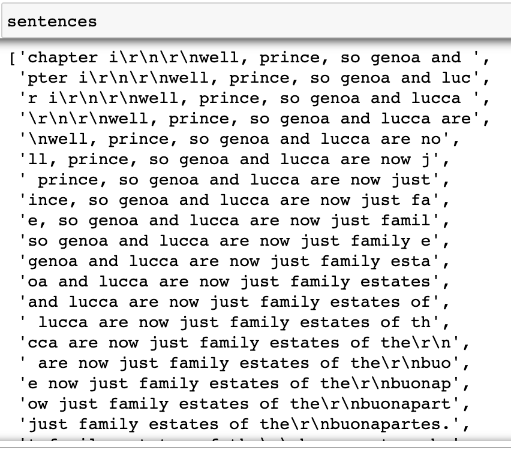
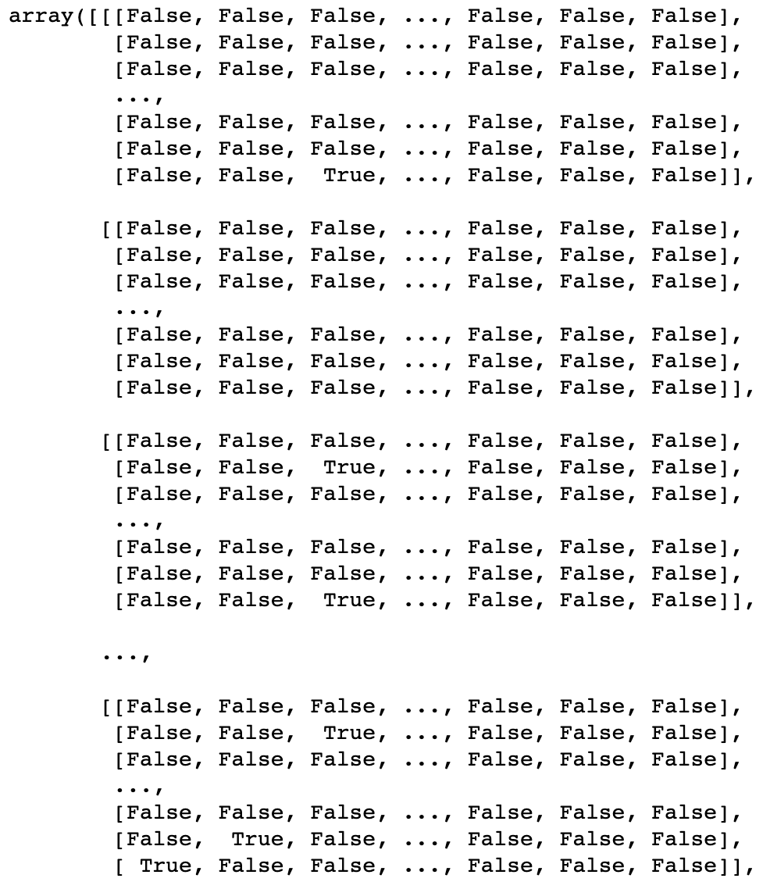
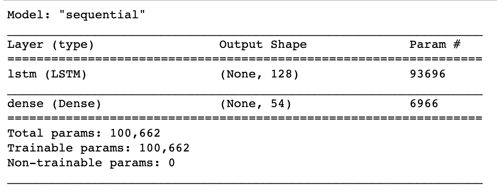
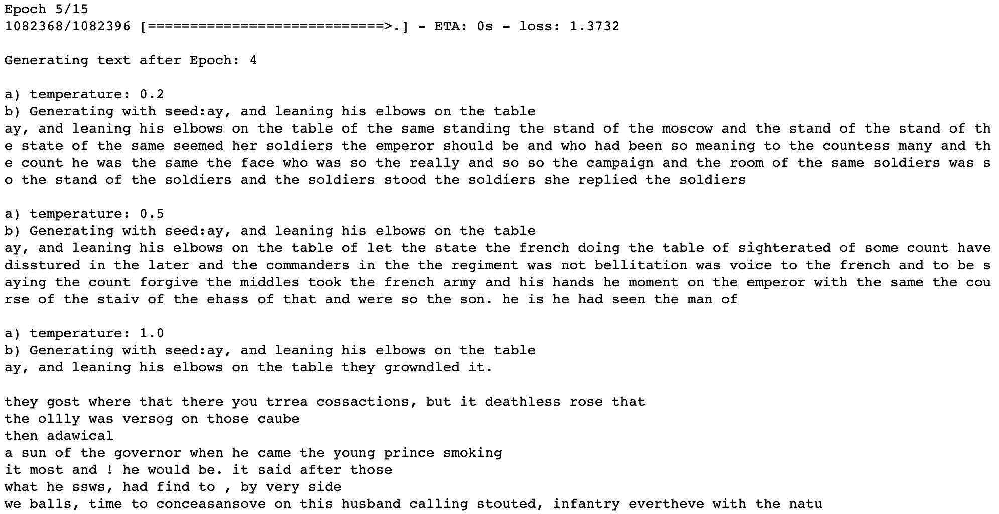
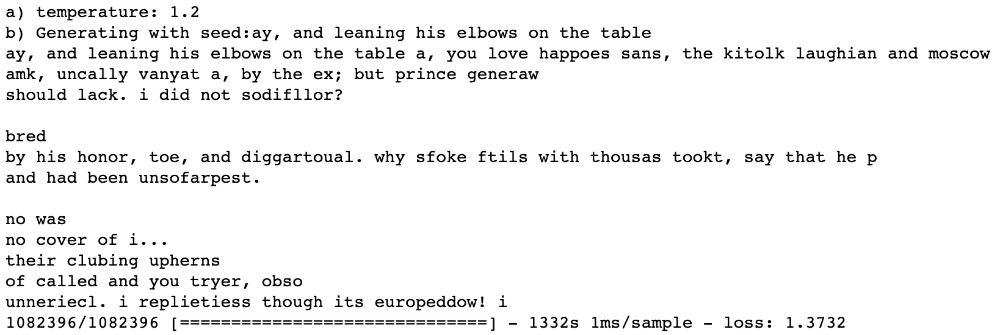
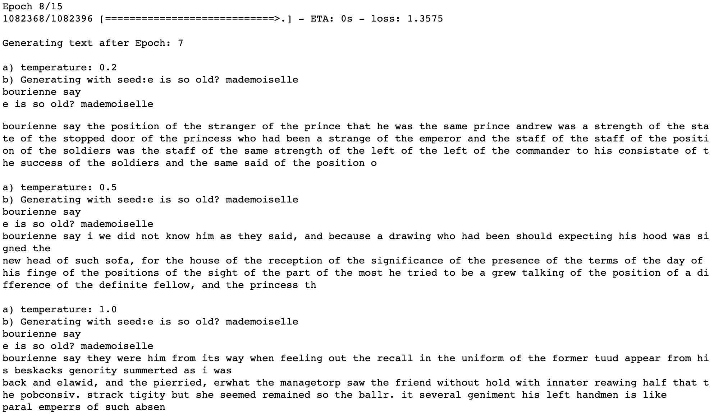
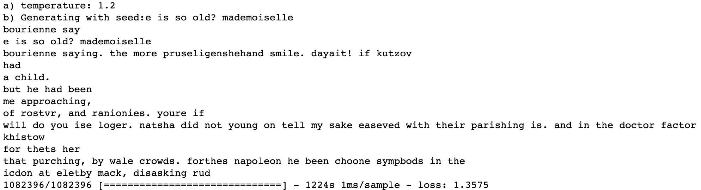

LSTM-Text-generation

Main concept of our project was to deliver generated text on the basis of previously created text by Leo Tolstoy.

We have taken LSTM Recurrent Neural Networks in order to use them as generative models. Our goal was to not use them only as predictive models but what is more they learn the sequences of a problem and then generate entirely new text.

During our project we have discovered how to create a generative model for text, with the usage of LSTM recurrent neural networks in Python with Keras.

Step by step:

1. Choosing the text - https://www.gutenberg.org/files/2600/2600-0.txt

2. Preparation of the text- modification of the txt in order the model could work

3. Division of text into small batches (40 characters each)

4. Vectorization of the batches

5. LSTM Model creation

6. Fitting the model based on vectorised characters and printing the output using callback function

Code comes of a course T81-558: Applications of Deep Neural Networks by Jeff Heaton 
https://github.com/jeffheaton/t81_558_deep_learning/blob/master/t81_558_class_10_3_text_generation.ipynb
